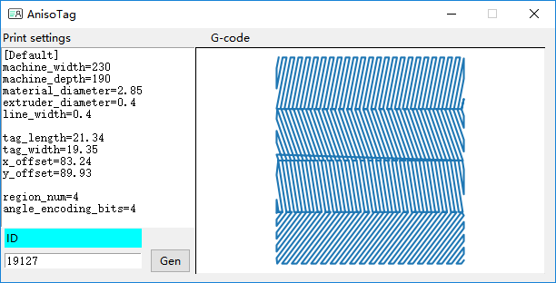

# AnisoTag G-code tool

The G-code tool proposed in "**AnisoTag: 3D Printed Tag on 2D Surface via Reflection Anisotropy**" published in Proceedings of the 2023 CHI Conference on Human Factors in Computing Systems (**CHI ’23**). [[DOI](https://doi.org/10.1145/3544548.3581024)] | [[arXiv](https://doi.org/10.48550/arXiv.2301.10599)] | [[Bibtex](#reference)]

This tool could generate G-code instructing the 3D printer to fabricate smooth cylinder surface (SCS) microstructures in one rectangular region.



## Notes
### `GUI.py`
Directly generate one G-code file named `./AnisoTag.gcode` with input parameters and default setting, which could be used to fabricate one single-layer AnisoTag with Ultimaker S3. Note that the GUI is designed for the screen with a resolution of $1080\times 1920$. For screens with different resolutions, you can modify `self.init_window_name.geometry` in `MY_GUI()` for the correct GUI display. 

### `AnisoTag_gen.py`
The source code of AnisoTag G-code generation. Recommend generating G-code directly from this code.

## Adjustment for your 3D printer
### header & footer files
Even though `.gcode` is one universal format of 3D printing files, different brands of 3D printers have specific header and footer files. To fabricate AnisoTag G-code with 3D printer A, the header and footer files should be extracted from the G-code file generated from the recommended slice software of 3D printer A and imported into `AnisoTag_gen.py`.

Available header & footer files:
- Creality Ender-3 V2: `header_creality.txt`, `footer_creality.txt`
- Ultimaker S3: `header.txt`, `header2.txt`, `footer.txt`

### Extruding settings
AnisoTag leverages the flowability and surface tension of molten material to fabricate SCS microstructure, which is hard to model because of the interaction of multiple complex factors, e.g., temperature, humidity, filament, and nozzle. For 3D printer A and its working environment, the following settings in `print_obj()` of `AnisoTag_gen.py` should be adjusted for SCS microstructure fabrication.
- `self.extruding_scale_factor` The scale factor of the calculated filament extruding amount. The default setting is 0.85, the same as the source code of Cura Engine.
- `self.top_layer_thickness` A slightly higher top layer thickness is helpful for the SCS microstructure generation on the top surface, commonly setting from 0.3 to 0.5.

### Nonlinear mapping function
`map_inverse.mat` is generated with $\mathcal{I}=f(\alpha, \phi, d)$ corresponding to our experimental settings. The relevant code is coming soon.

---
## Reference
<span id="reference">

```bibtex
@inproceedings{DBLP:conf/chi/abs-2301-10599,
  author    = {Zehua Ma and Hang Zhou and Weiming Zhang},
  title     = {AnisoTag: 3D Printed Tag on 2D Surface via Reflection Anisotropy},
  year      = {2023},
  doi       = {10.1145/3544548.3581024},
  booktitle = {Proceedings of the 2023 CHI Conference on Human Factors in Computing Systems (CHI '23)}}
```

</span>